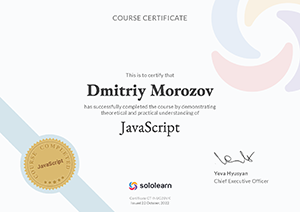
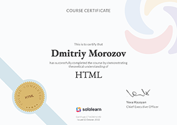
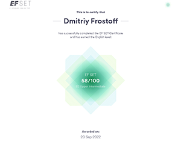

# **Dmitriy Morozov**


## **_Frontend Developer_**

## **Contact information:**

Phone: +7 987 654 32 10  
E-mail: <dmitriy.frostoff@yandex.ru>  
LinkedIn: [dmitriy-frostoff](https://www.linkedin.com/in/dmitriy-frostoff/ "my LinkedIn id: dmitriy-frostoff")  
Telegram: @Dmitriy_Frostoff  
Discord: @Dmitriy-Frostoff#9603  
app.rs.school: Dmitriy_Morozov  
GitHub: [dmitriy-frostoff](https://github.com/Dmitriy-Frostoff/ "My github acc")  
[instagram](https://www.instagram.com "my insta id: dmitriy.frostoff")  
[sololearn](https://www.sololearn.com/profile/16514154 "my acc on sololearn.com")  
[codewars](https://www.codewars.com/users/rsschool_78dcfb24c923f558 "my acc in codewars.com")

---

## **About Me:**

Hi!) I'm Dmitriy Morozov (a.k.a Dmitriy Frostoff).

Positive, sympathetic, responsible, friendly person that likes learning how to learn and applying this skill for reaching mastery in interesting business!))

I want to reveal all my abilities in the best possible way in Frontend Development and Software Engineering!)

---

## **Skills and Proficiency:**

_Computer Science Basics_

- Functional Programming
- Object-Oriented Programming (OOP)

_Languages_

- JavaScript
- TypeScript
- Python (beginner level)
- HTML
- CSS
- Regex

_Preprocessors_

- Sass/SCSS
- Pug

_Frameworks_

- React

_Bundlers and Task Runners_

- Webpack
- Gulp
- Execa

_Code formatting_

- ESLint
- Prettier
- Husky
- Babel

_Testing_

- Test design techniques
- Tests Design patterns
- Testing Library
- Jest
- Mocha
- Chai

_Documenting_

- JSDoc
- TSDoc
- Markdown

_Version Control System (VCS)_

- Git, GitHub

_IDEs/Editors_

- VS Code

_Design applications_

- Figma
- Adobe Photoshop (beginner level)
- Krita (beginner level)

**Architecture**  
(basic knowledge and usage)

- Clean Architecture
- MVC
- MVP
- MVVM
- Modular Architecture
- Atomic design
- Feature-Sliced Design(FSD)

---

## **Code example:**

**DESCRIPTION:**

**Never visit a . . . !?**  
[Codewars Kata description](https://www.codewars.com/kata/56c5847f27be2c3db20009c3/javascript "click to go to Codewars")  
**Subtract the sum**  
Complete the function which get an input number n such that `n >= 10` and `n < 10000`, then:  
Sum all the digits of `n`.  
Subtract the sum from `n`, and it is your new `n`.  
If the new `n` is in the list below return the associated fruit, otherwise return back to task 1.  
**Example**  
n = `325`  
sum = `3+2+5` = `10`  
n = `325-10` = `315` (not in the list)  
sum = `3+1+5` = `9`  
n = `315-9` = `306` (not in the list)  
sum = `3+0+6` = `9`  
n = `306-9` = `297` (not in the list)  
.  
.  
.

...until you find the first `n` in the list below.  
There is no preloaded code to help you. _This is not about coding skills; think before you code_

<details>
    <summary>click to view drawn-out object (CAUTION! far drawn-out!!!)</summary>
    <pre>
        const DICTIONARY = {
            1:`kiwi`,
            2:`pear`,
            3:`kiwi`,
            4:`banana`,
            5:`melon`,
            6:`banana`,
            7:`melon`,
            8:`pineapple`,
            9:`apple`,
            10:`pineapple`,
            11:`cucumber`,
            12:`pineapple`,
            13:`cucumber`,
            14:`orange`,
            15:`grape`,
            16:`orange`,
            17:`grape`,
            18:`apple`,
            19:`grape`,
            20:`cherry`,
            21:`pear`,
            22:`cherry`,
            23:`pear`,
            24:`kiwi`,
            25:`banana`,
            26:`kiwi`,
            27:`apple`,
            28:`melon`,
            29:`banana`,
            30:`melon`,
            31:`pineapple`,
            32:`melon`,
            33:`pineapple`,
            34:`cucumber`,
            35:`orange`,
            36:`apple`,
            37:`orange`,
            38:`grape`,
            39:`orange`,
            40:`grape`,
            41:`cherry`,
            42:`pear`,
            43:`cherry`,
            44:`pear`,
            45:`apple`,
            46:`pear`,
            47:`kiwi`,
            48:`banana`,
            49:`kiwi`,
            50:`banana`,
            51:`melon`,
            52:`pineapple`,
            53:`melon`,
            54:`apple`,
            55:`cucumber`,
            56:`pineapple`,
            57:`cucumber`,
            58:`orange`,
            59:`cucumber`,
            60:`orange`,
            61:`grape`,
            62:`cherry`,
            63:`apple`,
            64:`cherry`,
            65:`pear`,
            66:`cherry`,
            67:`pear`,
            68:`kiwi`,
            69:`pear`,
            70:`kiwi`,
            71:`banana`,
            72:`apple`,
            73:`banana`,
            74:`melon`,
            75:`pineapple`,
            76:`melon`,
            77:`pineapple`,
            78:`cucumber`,
            79:`pineapple`,
            80:`cucumber`,
            81:`apple`,
            82:`grape`,
            83:`orange`,
            84:`grape`,
            85:`cherry`,
            86:`grape`,
            87:`cherry`,
            88:`pear`,
            89:`cherry`,
            90:`apple`,
            91:`kiwi`,
            92:`banana`,
            93:`kiwi`,
            94:`banana`,
            95:`melon`,
            96:`banana`,
            97:`melon`,
            98:`pineapple`,
            99:`apple`,
            100:`pineapple`,
          }
        </pre>
</details>

**My decision:**

```JavaScript

// "use strict";

function SubtractSum(n) {
    function numberToSumOfNumbers(num) {
      return `${num}`
        .split(``)
        .map(elem => +elem)
        .reduce((sum, num) => sum + num, 0)
    }

    function newNumber(oldNumber, sum) {
      return oldNumber - sum;
    }

    function checkTheDictionary(newNumber, DICTIONARY) {
      return DICTIONARY[newNumber] ? true : false;
    }

    let nextNumber = newNumber(n, numberToSumOfNumbers(n));

    function recursionIteration(nextNumber) {
      if (checkTheDictionary(nextNumber, DICTIONARY)) {
        return DICTIONARY[nextNumber];
    } else {
        nextNumber = newNumber(nextNumber, numberToSumOfNumbers(nextNumber));
        return recursionIteration(nextNumber);
      }
    }

    return recursionIteration(nextNumber);

    // or just return `apple`, it'll fit perfectly)))
    // extremely enjoyed this Kata)))))))))) :)
  //   return "apple";
  }
```

---

## **Job experience**

**Student Frontend Developer at "The Rolling Scopes School"**  
September 2022 — present

Learning Software Engineering and Frontend Development at the Rolling Scopes School. I also do part-time jobs at the moment.

**Activity:**

Learning Software Engineering and Frontend Development at the Rolling Scopes School. I also do part-time jobs at the moment.

Activity:

- creating landing pages based on Figma layouts (Webpack 5, Gulp 5, JavaScript, TypeScript, SCSS / CSS, HTML);
- development of applications (Webpack 5, JavaScript, TypeScript, SCSS / CSS, HTML);
- learning the modern stack of technologies and methodologies of Frontend development;
- learning how to write "Clean code". Formatting of own code and commits messages using ESLint, Prettier, Husky;
- learning Software Development Lifecycle (SDLC), Software Engineering, getting acknowledge to the basics of Agile (Scrum, Kanban) and Waterfall Software Development Methodology;
- independent search for solutions to emerging technical problems and up-to-date technical information to complete the tasks set;
- development within the time limits set in the TOR;
- code review of other students' work based on the established TOR (Cross-Check);
- correction and refactoring of my works due to the comments received during the code review (Cross-Check);
- learning Behavior-driven development (BDD), Test - driven development (TDD) and writing Unit, integration tests (Mocha + Chai, Jest, React Testing library);
- interaction with other students and more experienced developers - to improve the quality of own code, to find optimal solutions. Active usage "30 minutes rule" for solving technical problems with your application. Active AI helpers usage (actual chatGPT);

**Stack:**
HTML5, CSS3, JavaScript, TypeScript, SCSS, React 18, Webpack 5, Gulp 5, Execa, NodeJS, Eslint, AirBnB config, Prettier, Husky, Babel, Execa, NodeJS, Testing Library, Jest, Mocha, Chai, JSDoc, TSDoc, Markdown, Git, VSCode, Figma, RegExp, Windows

**Civil engineer at Department of construction and repair of FSUE "Production Supply Enterprise", Moscow**  
December 2019 — August 2022

- Preparation of sets of documents for commissioning of the facility;
- Input control of project and budget documents;
- Interaction with the budget department;
- Archiving and maintenance of building site records;
- preparation of reports on construction materials used in the construction of buildings;
- participation in the commissioning of a finished construction facility;

**Civil engineer (general construction) at "UNR-17", Moscow**  
August 2019 — October 2019

- Preparation of sets of documents for commissioning of the facility;
- Input control of project and budget documents;
- Interaction with the budget department;

**Junior foreman, acting job superintendant (within 6 months), Junior foreman of building and finishing works at LLC "Tashir-Construction", Moscow**  
August 2018 — August 2019

- organization of works on construction of monolithic structures of buildings, manufacture of finishing works;

**Structural engineer at LLC GC "Olimproekt", Moscow**  
April 2017 — June 2018

- Collective development of project and detailed documentation of excavation enclosures, of structural elements of buildings;

**Assistant Chief structural Engineer (3rd year student) at LLC MC "Dinpos", Moscow**  
June 2015 — July 2015

- Familiarity with projects and documentation at the stages of implementation: PD, DD;
- Calculations of structures in SCC SCAD and manually; verification of calculations;
- Application of the skills of a structural engineer;

---

## **Education**

### **University:**

Moscow State University of Civil Engineering

Civil Construction engineer

**2018** - Master of Science (diploma with honor)

**2016** - Bachelor of Science (diploma with honor)

### **Courses:**

- [Stepik: JavaScript для начинающих](https://stepik.org/cert/1760637 "click to see origin document")

  

- [Sololearn: JavaScript](https://www.sololearn.com/certificates/CT-INUG28VK "click to see origin document")

  

- [CodeBasics: JavaScript](https://code-basics.com/ru/languages/javascript "click to go to the website")

- JavaScript Manual on [learn.javascript.ru](https://learn.javascript.ru "click to go to the website")

- [Microsoft Learn: TypeScript](https://learn.microsoft.com/ru-ru/training/paths/build-javascript-applications-typescript/ "click to go to the website")

- [TypeScript Documentation](https://www.typescriptlang.org/docs/ "click to go to the website")

- [React Documentation](https://react.dev/learn "click to go to the website")

- [Sololearn: Python for beginners](https://www.sololearn.com/certificates/CT-KHNYMAG8 "click to see origin document")

  

- [CodeBasics: Python](https://code-basics.com/ru/languages/python "click to go to the website") (in progress)
- [Sololearn: HTML](https://www.sololearn.com/certificates/CT-ACB0NUVD "click to see origin document")

  

- [CodeBasics: HTML](https://code-basics.com/ru/languages/html "click to go to the website")

- [Sololearn: CSS](https://www.sololearn.com/certificates/CT-2R1CKLL5 "click to see origin document")

  

- [CodeBasics: CSS](https://www.sololearn.com/certificates/CT-2R1CKLL5 "click to go to the website")

- [Sololearn: Responsive Web Design](https://www.sololearn.com/certificates/CT-L3S4OUVO "click to see origin document")

  

- [Sololearn: Web Development Fundamentals](https://www.sololearn.com/certificates/CT-IEFGC3DR "click to see origin document")

  

- [Coursera: Barbara Oakley and Dr. Terrence Sejnowski "Learning-how-to-learn"](https://ru.coursera.org/learn/learning-how-to-learn "click to go to the website") (in progress)

- [Stepik: How to Study effectively - Polina Krivykh x I Love Economics](https://stepik.org/cert/1766516 "click to see origin document")

  

- RS Schools Course «JavaScript/Front-end» JavaScript/Front-end 2022Q3

- RS Schools Course Javascript/Front-end Mentoring Program (in English)» JS/FE Course EN 2022Q3

- [RS Schools Course «JavaScript/Front-end. Stage 0» JS/FE Pre-School 2022Q4](https://app.rs.school/certificate/7rf4cdis/ "click to see origin document")

  

- RS Schools Course «JavaScript/Front-end» JavaScript/Front-end 2023Q1

- [RS Schools Course «JavaScript/Front-end. Stage 0» JS/FE Pre-School 2023Q2](https://app.rs.school/certificate/od2zjglq "click to see origin document")

- RS Schools Course «JavaScript/Front-end» JavaScript/Front-end 2023Q4

---

## **Projects**

**Youtube-dl_utility**  
Project Description:

Custom utility created by me for downloading videos and audios from a range of sites. Maintained by me.

- [youtube-dl_utility](https://github.com/Dmitriy-Frostoff/youtube-dl_utility "click to view repo")

---

**Boilerplate-jest**  
Project Description:

Custom boilerplate created by me for integrating the Jest testing framework (with optional Testing-library) into future projects (ESM - based). Maintained by me.

- [boilerplate-jest](https://github.com/Dmitriy-Frostoff/boilerplate-jest "click to view repo")

---

**Boilerplate-webpack-react-ts**  
Project Description:

Custom boilerplate created by me for integrating React (with hooks) with TS into future projects (ESM && FSD - based. note: boilerplate-webpack-gulp-html-scss-ts-components required! (Gulp can be deleted smoothly)). Maintained by me.

- [boilerplate-webpack-react-ts](https://github.com/Dmitriy-Frostoff/boilerplate-webpack-react-ts "click to view repo")

---

**Boilerplate-webpack-react-js**  
Project Description:

Custom boilerplate created by me for integrating React (with hooks) with pure JS into future projects (ESM && FSD - based. note: boilerplate-webpack-gulp-html-scss-js-components required! (Gulp can be deleted smoothly)). Maintained by me.

- [boilerplate-webpack-react-js](https://github.com/Dmitriy-Frostoff/boilerplate-webpack-react-js "click to view repo")

---

**Boilerplate-webpack-gulp-html-scss-js-components**  
Project Description:

Custom boilerplate created by me for integrating Webpack, Gulp, SCSS, HTML, TS (ESM && FSD - based) into future projects. Maintained by me.

- [boilerplate-webpack-gulp-html-scss-ts-components](https://github.com/Dmitriy-Frostoff/boilerplate-webpack-gulp-html-scss-ts-components "click to view repo")

---

**Boilerplate-webpack-gulp-html-scss-js-components**  
Project Description:

Custom boilerplate created by me for integrating Webpack, Gulp, SCSS, HTML, JS (ESM && FSD - based) into future projects. Maintained by me.

- [boilerplate-webpack-gulp-html-scss-js-components](https://github.com/Dmitriy-Frostoff/boilerplate-webpack-gulp-html-scss-js-components "click to view repo")

---

**Boilerplate-eslint-prettier-husky**  
Project Description:

Custom boilerplate created by me for integrating ESLint, Prettier, and Husky (with hooks) into future projects.

There are several frontend-oriented boilerplates that I developed, designed for specific tasks in frontend development. These boilerplates follow the FSD architecture and are built on principles of low coupling and high cohesion, allowing them to be easily combined or removed as needed. You can selectively include only the required boilerplates (note: the React-based boilerplate requires the Webpack boilerplate).

All of them are maintained by me.

- [boilerplate-eslint-prettier-husky](https://github.com/Dmitriy-Frostoff/boilerplate-eslint-prettier-husky "click to view repo")

---

**js30#2.2-image-galery**  
Project Description:

You need to create an application that displays the photos received from the API. Add a search to the application. When entering a search query, the photos that are displayed in the application are changed.

- [js30#2.2-image-galery](https://rolling-scopes-school.github.io/dmitriy-frostoff-JSFEPRESCHOOL2023Q2/image-galery/index.html "click to view")

---

**js30#1.2-audio-player**  
Project Description:

A music player that allows you to play music tracks in turn or flip through them by clicking on buttons. Each music track has a specific background image.

- [js30#1.2-audio-player](https://rolling-scopes-school.github.io/dmitriy-frostoff-JSFEPRESCHOOL2023Q2/audio-player/index.html "click to view")

---

**CSS Meme Slider**  
Project Description:

CSS Meme Slider is a task of Rolling Scopes School stage 0.

- [CSS Meme Slider](https://dmitriy-frostoff.github.io/cssMemeSlider/cssMemeSlider/index.html "click to view")

---

**Library**  
Project Description:

Library is a stage #0 task in the course of which you will make the landing page of the site for the selection and sale of books, make it adaptive and interactive.

- [Library](https://rolling-scopes-school.github.io/dmitriy-frostoff-JSFEPRESCHOOL2023Q2/library/index.html "click to view")

---

**Shelter**  
Project Description:

Shelter is a project in which you have to create a website consisting of two pages, make it adaptive and interactive.

- [Shelter](https://rolling-scopes-school.github.io/dmitriy-frostoff-JSFE2023Q1/shelter/index.html "click to view")

---

**CSSBayan**  
Project Description:

Accordion implemented with the only HTML and CSS.

- [CSSBayan](https://dmitriy-frostoff.github.io/cssBayan/cssBayan/index.html "click to view")

---

**Momentum**  
Project Description:

Momentum is an analogue of the Chrome Web Store application of the same name. The application shows the time and username. The background image and greeting changes depending on the time of day.

The application has a clock, an image slider, weather widgets, an audio player, a quote of the day block, and settings. Local storage is used to store the username and location.

- [Momentum web app](https://rolling-scopes-school.github.io/dmitriy-frostoff-JSFEPRESCHOOL2022Q4/momentum/ "click to view")

---

**Plants**  
Project Description:

Plants is the stage#0 task during which you will make up the landing page of a site that offers its services for growing plants in the garden and caring for them, making it adaptive and interactive.

- [Plants landing page](https://rolling-scopes-school.github.io/dmitriy-frostoff-JSFEPRESCHOOL2022Q4/plants/ "click to view")

---

**CV#3. CV. Cross-Check**  
CV implemented with HTML, CSS, JS and TS

- [CV#3. CV. Cross-Check](https://dmitriy-frostoff.github.io/rsschool-cv "click to view")

---

**CV#1. Markdown & Git**  
This page done using Markdown

- [CV#1. Markdown & Git](https://github.com/Dmitriy-Frostoff/rsschool-cv/blob/gh-pages/cv.md "click to view")

---

## **Languages:**

English - Upper-Intermediate B2 according to the online EF SET test at

 [www.efset.org](www.efset.org "click to go to the website")

[my certificate](https://www.efset.org/cert/4Tg7Hj "click to see origin document")



(continue learning in [lingualeo](https://lingualeo.com/ "click to go to the website"))

Russian - Native
