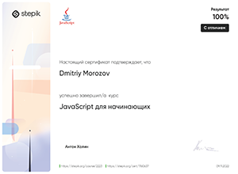
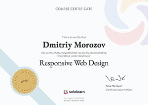
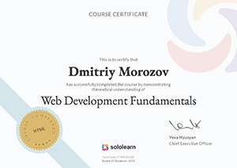

# **Dmitriy Morozov**


## ***Junior Frontend Developer***

***     

## **Contact information:**
Phone: +7 987 654 32 10  
E-mail: <dmitriy.frostoff@yandex.ru>  
Telegram: @Dmitriy_Frostoff  
Discord: @Dmitriy-Frostoff#9603  
app.rs.school: Dmitriy_Morozov  
GitHub: [dmitriy-frostoff](https://github.com/Dmitriy-Frostoff/ "My github acc")  
[instagram](https://www.instagram.com "my insta id: dmitriy.frostoff")  
[sololearn](https://www.sololearn.com/profile/16514154 "my acc on sololearn.com")   
[codewars](https://www.codewars.com/users/rsschool_78dcfb24c923f558 "my acc in codewars.com")   

***     

## **About Me:**
Hi! I'm Dmitriy Morozov (or Dmitriy Frostoff as I prefer in most conditions :).

 I'm a civil construction engineer, but recently (about march - june of 2022) after 5 years of working I've understood finally, that I didn't like constructional sphere at all. And as because I always was intrested in programming, then I started learning "Python for beginners" and it was so satisfying for me to have challenges and resolve them and then growing up (I extremely like Mathematic analisys and Phisics, Music, Drawing. In Moscow State University of Civil Engineering I had two diplomas with honors (red diplomas)).

 After conducting a deep introspection, I realized that I was equally interested in the following aspects: 
 + programming (I love being in a state of flow, brainstorming and growing above myself 🤩);

 + playing and composing music (I can play guitar, keys, a little on drums, I study vocals, I'm obsessed with music 😍);

 + studying the learning process itself (cognitive science);

 + the art of bonsai.
 
Now I wanna to reveal my abilities in the best possible way in Front-end Developing.  

***     

## **Skills and Proficiency:**
* Python (beginner level)  
* JavaScript
* JQuery  
* HTML 
* CSS
* Sass/SCSS (beginner level)
* Webpack (beginner level)
* Git, GitHub  
* Markdown  
* VS Code  
* Figma  
* Adobe Photoshop (beginner level)  
* Krita (beginner level)  

***     

## **Code example:**  

**DESCRIPTION:**

**Bingo Card**  

After yet another dispute on their game the Bingo Association decides to change course and automate the game.   

Can you help the association by writing a method to create a random Bingo card?   

Bingo Cards   
A Bingo card contains 24 unique and random numbers according to this scheme:   
  + 5 numbers from the B column in the range 1 to 15
  + 5 numbers from the I column in the range 16 to 30
  + 4 numbers from the N column in the range 31 to 45
  + 5 numbers from the G column in the range 46 to 60
  + 5 numbers from the O column in the range 61 to 75

Task
Write the function get_card()/getCard(). The card must be returned as an array of Bingo style numbers:

```[ 'B14', 'B12', 'B5', 'B6', 'B3', 'I28', 'I27', ... ]```   

The numbers must be in the order of their column: B, I, N, G, O. Within the columns the order of the numbers is random.   


**My decision:**  

```javascript  

  // "use strict";

  function getCard() {
      // Start your coding here...

      const arrBprototype = [];

      const arrIprototype = [];

      const arrNprototype = [];

      const arrGprototype = [];

      const arrOprototype = [];

      const getRandomNumberFromRangeInclusive = (min, max) => {
          min = Math.ceil(min);

          max = Math.floor(max);

          return Math.floor(Math.random() * (max - min + 1) + min);
      }

      const checkArrayForIncludeElem = (elem, arr, columnPrefix) => {
          if (arr.includes(`${columnPrefix}${elem}`)) {
          return true;
          } else {
          return false;
          }
      }

      const arrFillRandomNumber = (arr, requiredLength, columnPrefix, rangeMin, rangeMax) => {
          for (let i = 0; i < requiredLength; i++) {
          if (arr.length === requiredLength) {
              return;
          }

          let elem = getRandomNumberFromRangeInclusive(rangeMin, rangeMax);

          if (checkArrayForIncludeElem(elem, arr, columnPrefix)) {
              arrFillRandomNumber(arr, requiredLength, columnPrefix, rangeMin, rangeMax);
          } else {
              arr.push(`${columnPrefix}${elem}`);
          }
          }
      }

      arrFillRandomNumber(arrBprototype, 5, 'B', 1, 15);

      arrFillRandomNumber(arrIprototype, 5, 'I', 16, 30);

      arrFillRandomNumber(arrNprototype, 4, 'N', 31, 45);

      arrFillRandomNumber(arrGprototype, 5, 'G', 46, 60);

      arrFillRandomNumber(arrOprototype, 5, 'O', 61, 75);

      return [...arrBprototype, ...arrIprototype, ...arrNprototype, ...arrGprototype, ...arrOprototype];
  }
```

***     
## **Job experience**

***     

**Civil engineer at Department of construction and repair of FSUE "Production Supply Enterprise", Moscow**    
December 2019 — August 2022   
  * Preparation of sets of documents for commissioning of the facility;
  * Input control of project and budget documents;
  * Interaction with the budget department;
  * Archiving and maintenance of building site records;
  * preparation of reports on construction materials used in the construction of buildings;
  * participation in the commissioning of a finished construction facility;

**Civil engineer (general construction) at "UNR-17", Moscow**    
August 2018 — August 2019   
  * Preparation of sets of documents for commissioning of the facility;
  * Input control of project and budget documents;
  * Interaction with the budget department;
  

**Junior foreman, acting job superintendant (within 6 months),  Junior foreman of building and finishing works at LLC "Tashir-Construction", Moscow**    
August 2018 — August 2019   
  * organization of works on construction of monolithic structures of buildings, manufacture of finishing works;

**Structural engineer at LLC GC "Olimproekt", Moscow**    
April 2017 — June 2018   
  * Collective development of project and detailed documentation of excavation enclosures, of structural elements of buildings;

**Assistant Chief Design Engineer (3rd year student) at LLC MC "Dinpos", Moscow**    
June 2015 — July 2015   
  * Familiarity with projects and documentation at the stages of implementation: PD, DD;
  * Calculations of structures in SCC SCAD and manually; verification of calculations;
  * Application of the skills of a structural engineer;

***     

## **Education**

***     

### **University:**
Moscow State University of Civil Engineering

Civil Construction engineer

***2018** - masters degree (diploma with honor)*  

***2016** - bachelor degree (diploma with honor)*

### **Courses:**  
* [Sololearn: Python for beginners](https://www.sololearn.com/certificates/CT-KHNYMAG8 "click to see origin document")

     

* [CodeBasics: Python](https://code-basics.com/ru/languages/python "click to go to the website") (in progress)   

* [Sololearn: JavaScript](https://www.sololearn.com/certificates/CT-INUG28VK "click to see origin document")  

     

* [Stepik: JavaScript для начинающих](https://stepik.org/cert/1760637 "click to see origin document")

      

* JavaScript Manual on [learn.javascript.ru](https://learn.javascript.ru "click to go to the website") (in progress)

* [CodeBasics: JavaScript](https://code-basics.com/ru/languages/javascript "click to go to the website")   

* [Sololearn: HTML](https://www.sololearn.com/certificates/CT-ACB0NUVD "click to see origin document")   

  

* [CodeBasics: HTML](https://code-basics.com/ru/languages/html "click to go to the website")   

* [Sololearn: CSS](https://www.sololearn.com/certificates/CT-2R1CKLL5 "click to see origin document")   

     

* [CodeBasics: CSS](https://www.sololearn.com/certificates/CT-2R1CKLL5 "click to go to the website")   

* [Sololearn: Responsive Web Design](https://www.sololearn.com/certificates/CT-L3S4OUVO "click to see origin document")   

     

* [Sololearn: Web Development Fundamentals](https://www.sololearn.com/certificates/CT-IEFGC3DR "click to see origin document")   

     

* [Coursera: Barbara Oakley and Dr. Terrence Sejnowski "Learning-how-to-learn"](https://ru.coursera.org/learn/learning-how-to-learn "click to go to the website") (in progress)

* [Stepik: How to Study effectively - Polina Krivykh x I Love Economics](https://stepik.org/cert/1766516 "click to see origin document")   

     

* RS Schools Course «JavaScript/Front-end» JavaScript/Front-end 2022Q3   

* RS Schools Course Javascript/Front-end Mentoring Program (in English)» JS/FE Course EN 2022Q3   

* [RS Schools Course «JavaScript/Front-end. Stage 0» JS/FE Pre-School 2022Q4](https://app.rs.school/certificate/7rf4cdis/ "click to see origin document")   

     

* RS Schools Course «JavaScript/Front-end» JavaScript/Front-end 2023Q1 (in progress)  

***       

## **RSSchool projects**

***     

**Momentum**    
Project Description:   

Momentum is an analogue of the Chrome Web Store application of the same name. The application shows the time and username. The background image and greeting changes depending on the time of day.   

The application has a clock, an image slider, weather widgets, an audio player, a quote of the day block, and settings. Local storage is used to store the username and location.   

  * [Momentum web app](https://rolling-scopes-school.github.io/dmitriy-frostoff-JSFEPRESCHOOL2022Q4/momentum/ "click to view")   

**Plants**    
Project Description:   

Plants is the stage#0 task during which you will make up the landing page of a site that offers its services for growing plants in the garden and caring for them, making it adaptive and interactive.   

  * [Plants landing page](https://rolling-scopes-school.github.io/dmitriy-frostoff-JSFEPRESCHOOL2022Q4/plants/ "click to view")   

**CV#3. CV. Cross-Check**    
CV implemented with HTML & CSS   

  * [CV#3. CV. Cross-Check](https://dmitriy-frostoff.github.io/rsschool-cv "click to view")   

**CV#1. Markdown & Git**    
This page done using Markdown   

  * [CV#1. Markdown & Git](https://dmitriy-frostoff.github.io/rsschool-cv/cv "click to view")   

***     

## **Languages:**  
English - Upper-Intermediate B2 according to the online EF SET test at 

   [www.efset.org](www.efset.org "click to go to the website")

 [my certificate](https://www.efset.org/cert/4Tg7Hj "click to see origin document")  
 
  
 

 (continue learning in [lingualeo](https://lingualeo.com/ "click to go to the website")) 

Russian - Native