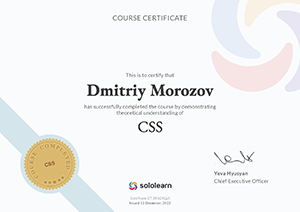

# **Dmitriy Morozov**


## ***Junior Frontend Developer***
***

## **Contact information:**
Phone: +7 916 723 20 43  
E-mail: <dmitriy.frostoff@yandex.ru>  
Telegram: @Dmitriy_Frostoff  
Discord: @Dmitriy-Frostoff#9603  
app.rs.school: Dmitriy_Morozov  
GitHub: [dmitriy-frostoff](https://github.com/Dmitriy-Frostoff/ "My github acc")  
[instagram](https://www.instagram.com "dmitriy.frostoff")  
[sololearn](https://www.sololearn.com/profile/16514154)   
[codewars](https://www.codewars.com/users/Dmitriy-Frostoff)   

***
## **About Me:**
Hi! I'm Dmitriy Morozov (or Dmitriy Frostoff as I prefer in most conditions :).

 I'm a civil construction engineer, but recently (about march - june of 2022) after 5 years of working I've understood finally, that I didn't like constructional sphere at all. And as because I always was intrested in programming, then I started learning "Python for beginners" and it was so satisfying for me to have challenges and resolve them and then growing up (I extremely like Mathematic analisys and Phisics, Music, Drawing. In Moscow State University of Civil Engineering I had two diplomas with honors (red diplomas)).

 After conducting a deep introspection, I realized that I was equally interested in the following aspects: 
 + programming (I love being in a state of flow, brainstorming and growing above myself 🤩);

 + playing and composing music (I can play guitar, keys, a little on drums, I study vocals, I'm obsessed with music 😍);

 + studying the learning process itself (cognitive science);

 + the art of bonsai.
 
Now I wanna to reveal my abilities in the best possible way in Front-end Developing.  

***
## **Skills and Proficiency:**
* Python (beginner level)  
* JavaScript (beginner level)
* JQuery  
* HTML 
* CSS (beginner level)
* Git, GitHub  
* Markdown  
* VS Code  
* Adobe Photoshop (beginner level)  
* Krita (beginner level)  

***
## **Code example:**  

**DESCRIPTION:**

**The museum of incredible dull things**  

The museum of incredible dull things wants to get rid of some exhibitions. Miriam, the interior architect, comes up with a plan to remove the most boring exhibitions. She gives them a rating, and then removes the one with the lowest rating.

However, just as she finished rating all exhibitions, she's off to an important fair, so she asks you to write a program that tells her the ratings of the items after one removed the lowest one. Fair enough.

Task
Given an array of integers, remove the smallest value. Do not mutate the original array/list. If there are multiple elements with the same value, remove the one with a lower index. If you get an empty array/list, return an empty array/list.

Don't change the order of the elements that are left.

**Examples**  
```* Input: [1,2,3,4,5], output = [2,3,4,5]
* Input: [5,3,2,1,4], output = [5,3,2,4]
* Input: [2,2,1,2,1], output = [2,2,2,1]
```
**My decision:**  

```javascript  
function removeSmallest(numbers) {
//   throw "TODO: removeSmallest";
  let EtrArr = numbers.slice();
  if (EtrArr.length == 0 || EtrArr.length == 1) {
    return [];
  }
  else {
    let minValue = Math.min.apply(null, EtrArr);
    let MinValueIndex = EtrArr.indexOf(minValue);
    EtrArr.splice(MinValueIndex, 1);
    return EtrArr;
  }
}
```
***
## **Education**
***
### **University:**
Moscow State University of Civil Engineering

Civil Construction engineer

***2018** - masters degree (diploma with honor)*  

***2016** - bachelor degree (diploma with honor)*

### **Courses:**  

* [Sololearn: Python for beginners](https://www.sololearn.com/certificates/CT-KHNYMAG8 "click to see origin document")

     

* [CodeBasics: Python](https://code-basics.com/ru/languages/python "click to go to the website") (in progress)   

* [Sololearn: JavaScript](https://www.sololearn.com/certificates/CT-INUG28VK "click to see origin document")  

     

* [Stepik: JavaScript для начинающих](https://stepik.org/cert/1760637 "click to see origin document")

      

* JavaScript Manual on [learn.javascript.ru](https://learn.javascript.ru "click to go to the website") (in progress)

* [CodeBasics: JavaScript](https://code-basics.com/ru/languages/javascript "click to go to the website") (in progress)   

* [Sololearn: HTML](https://www.sololearn.com/certificates/CT-ACB0NUVD "click to see origin document")   

  

* [CodeBasics: HTML](https://code-basics.com/ru/languages/html "click to go to the website")   

* [Sololearn: CSS](https://www.sololearn.com/certificates/CT-2R1CKLL5 "click to see origin document")   

     

* [CodeBasics: CSS](https://www.sololearn.com/certificates/CT-2R1CKLL5 "click to go to the website")   

* [Sololearn: Responsive Web Design](https://www.sololearn.com/certificates/CT-L3S4OUVO "click to see origin document")   

     

* [Sololearn: Web Development Fundamentals](https://www.sololearn.com/certificates/CT-IEFGC3DR "click to see origin document")   

     

* [Coursera: Barbara Oakley and Dr. Terrence Sejnowski "Learning-how-to-learn"](https://ru.coursera.org/learn/learning-how-to-learn "click to go to the website") (in progress)

* [Stepik: How to Study effectively - Polina Krivykh x I Love Economics](https://stepik.org/cert/1766516 "click to see origin document")   

     


RS Schools Course «JavaScript/Front-end. Stage 0» JS/FE Pre-School 2022Q4 (in progress)  

*** 
## **Languages:**  
English - Upper-Intermediate B2 according to the online EF SET test at 

   [www.efset.org](www.efset.org)

 [my certificate](https://www.efset.org/cert/4Tg7Hj)  
 
 
 

 (continue learning in [lingualeo](https://lingualeo.com/)) 

Russian - Native